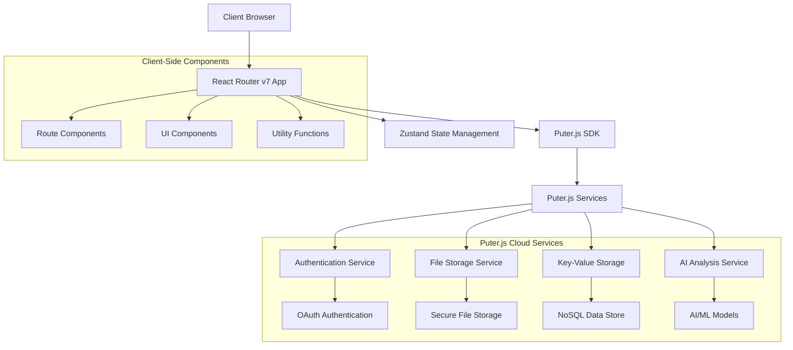
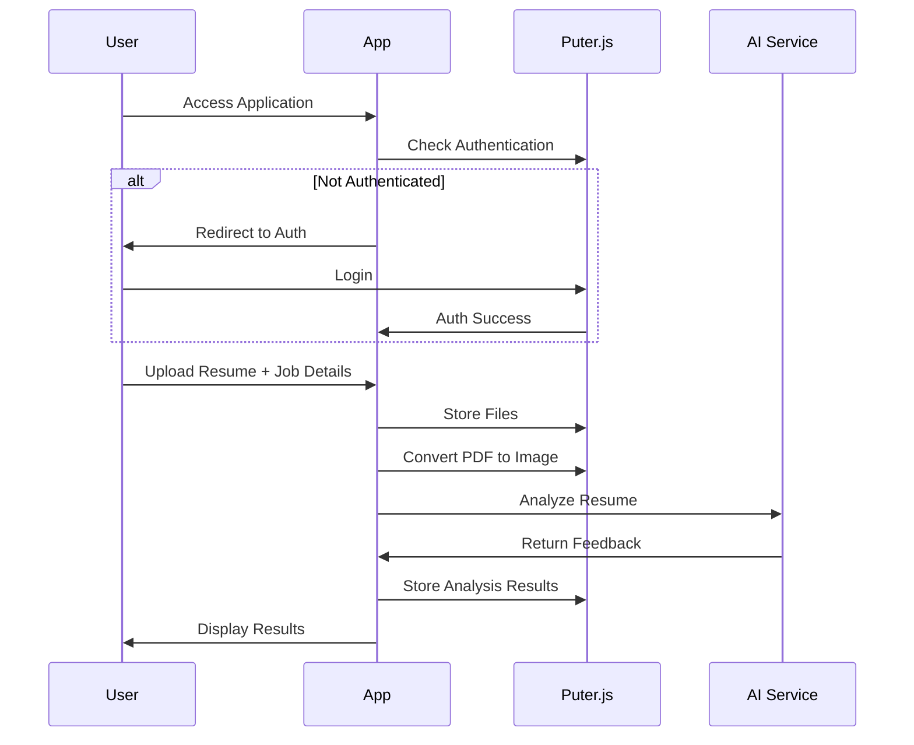

# AI Resume Analyzer - Design Document

## Overview

The AI Resume Analyzer is architected as a modern single-page application (SPA) using React Router v7 for client-side routing and Puter.js for serverless backend functionality. The application follows a component-based architecture with clear separation of concerns, utilizing Zustand for state management and Tailwind CSS for styling. The design emphasizes user experience through intuitive interfaces, real-time feedback, and responsive design patterns.

## Architecture

### High-Level Architecture



### Application Flow



## Components and Interfaces

### Core Components

#### 1. Authentication Components
- **AuthPage**: Handles user login/logout with Puter.js authentication
- **ProtectedRoute**: Wrapper component for authenticated routes
- **AuthGuard**: Higher-order component for route protection

#### 2. Navigation Components
- **Navbar**: Main navigation with user status and logout functionality
- **BackButton**: Contextual navigation for resume review pages

#### 3. Upload Components
- **FileUploader**: Drag-and-drop interface with file validation
- **UploadForm**: Form for collecting job details and resume upload
- **ProgressIndicator**: Visual feedback during upload and analysis

#### 4. Resume Management Components
- **ResumeCard**: Card component displaying resume summary and scores
- **ResumeGrid**: Grid layout for displaying multiple resume cards
- **EmptyState**: Component shown when no resumes exist

#### 5. Analysis Display Components
- **Summary**: High-level overview of resume analysis
- **ScoreGauge**: Circular progress indicator for overall scores
- **ScoreBadge**: Compact score display for categories
- **ScoreCircle**: Alternative circular score visualization
- **ATS**: Dedicated component for ATS-specific feedback
- **Details**: Expandable sections for detailed feedback
- **Accordion**: Collapsible content sections

### State Management Architecture

```typescript
interface AppState {
  // Authentication state
  auth: {
    isAuthenticated: boolean;
    user: User | null;
    isLoading: boolean;
  };
  
  // File operations
  files: {
    uploadProgress: number;
    isUploading: boolean;
    error: string | null;
  };
  
  // Resume data
  resumes: {
    items: Resume[];
    isLoading: boolean;
    currentResume: Resume | null;
  };
  
  // Analysis state
  analysis: {
    isAnalyzing: boolean;
    progress: string;
    error: string | null;
  };
}
```

### API Integration Layer

#### Puter.js Service Wrapper
```typescript
interface PuterService {
  // Authentication
  auth: {
    signIn(): Promise<void>;
    signOut(): Promise<void>;
    isAuthenticated: boolean;
  };
  
  // File Storage
  fs: {
    upload(files: File[]): Promise<UploadResult>;
    read(path: string): Promise<ArrayBuffer>;
    delete(path: string): Promise<void>;
  };
  
  // Key-Value Storage
  kv: {
    set(key: string, value: string): Promise<void>;
    get(key: string): Promise<string>;
    list(pattern: string): Promise<KVItem[]>;
    delete(key: string): Promise<void>;
  };
  
  // AI Services
  ai: {
    feedback(filePath: string, instructions: string): Promise<AIResponse>;
  };
}
```

## Data Models

### Resume Data Model
```typescript
interface Resume {
  id: string;                    // Unique identifier (UUID)
  companyName?: string;          // Target company name
  jobTitle?: string;             // Target job title
  jobDescription?: string;       // Job description for analysis
  imagePath: string;             // Path to resume image preview
  resumePath: string;            // Path to original PDF file
  feedback: Feedback;            // AI analysis results
  createdAt: Date;              // Upload timestamp
  updatedAt: Date;              // Last modification timestamp
}
```

### Feedback Data Model
```typescript
interface Feedback {
  overallScore: number;          // Overall resume score (0-100)
  
  ATS: {
    score: number;               // ATS compatibility score
    tips: FeedbackTip[];         // ATS-specific recommendations
  };
  
  toneAndStyle: {
    score: number;               // Writing tone and style score
    tips: DetailedFeedbackTip[]; // Style improvement suggestions
  };
  
  content: {
    score: number;               // Content quality score
    tips: DetailedFeedbackTip[]; // Content enhancement tips
  };
  
  structure: {
    score: number;               // Resume structure score
    tips: DetailedFeedbackTip[]; // Structural improvements
  };
  
  skills: {
    score: number;               // Skills alignment score
    tips: DetailedFeedbackTip[]; // Skills-related feedback
  };
}

interface FeedbackTip {
  type: "good" | "improve";      // Tip category
  tip: string;                   // Brief tip description
}

interface DetailedFeedbackTip extends FeedbackTip {
  explanation: string;           // Detailed explanation
}
```

### User Interface Models
```typescript
interface UploadFormData {
  companyName: string;
  jobTitle: string;
  jobDescription: string;
  file: File;
}

interface AnalysisProgress {
  stage: 'uploading' | 'converting' | 'analyzing' | 'complete' | 'error';
  message: string;
  progress?: number;
}
```

## Error Handling

### Error Categories and Handling Strategy

#### 1. Authentication Errors
- **Scenario**: Failed login, expired sessions
- **Handling**: Redirect to auth page with return URL, display user-friendly messages
- **Recovery**: Automatic retry, manual re-authentication

#### 2. File Upload Errors
- **Scenario**: Invalid file format, size limits, network issues
- **Handling**: Validate files client-side, provide specific error messages
- **Recovery**: Allow file re-selection, retry upload functionality

#### 3. AI Analysis Errors
- **Scenario**: AI service unavailable, analysis timeout, invalid responses
- **Handling**: Display progress indicators, provide retry options
- **Recovery**: Exponential backoff retry, fallback to cached results

#### 4. Data Storage Errors
- **Scenario**: Storage quota exceeded, network connectivity issues
- **Handling**: Graceful degradation, local caching where possible
- **Recovery**: Retry mechanisms, user notification of storage issues

### Error Boundary Implementation
```typescript
interface ErrorBoundaryState {
  hasError: boolean;
  error: Error | null;
  errorInfo: ErrorInfo | null;
}

// Global error boundary for unhandled exceptions
// Route-specific error boundaries for localized error handling
// Component-level error handling for specific operations
```

## Testing Strategy

### Unit Testing
- **Component Testing**: React Testing Library for component behavior
- **Utility Function Testing**: Jest for pure function testing
- **State Management Testing**: Zustand store testing with mock data
- **API Integration Testing**: Mock Puter.js services for isolated testing

### Integration Testing
- **User Flow Testing**: End-to-end user journeys from upload to analysis
- **API Integration Testing**: Real Puter.js service integration tests
- **Cross-Component Testing**: Component interaction and data flow testing

### Performance Testing
- **Load Testing**: Large file upload performance
- **Rendering Performance**: Component rendering optimization
- **Memory Usage**: State management and cleanup testing

### Accessibility Testing
- **Screen Reader Testing**: NVDA, JAWS, VoiceOver compatibility
- **Keyboard Navigation**: Tab order and keyboard-only navigation
- **Color Contrast**: WCAG 2.1 AA compliance verification
- **Focus Management**: Proper focus handling during navigation

## Security Considerations

### Data Protection
- **File Security**: Secure file upload and storage through Puter.js
- **Data Encryption**: All data encrypted in transit and at rest
- **Access Control**: User-specific data isolation and access controls

### Authentication Security
- **OAuth Integration**: Secure authentication through Puter.js OAuth
- **Session Management**: Secure session handling and timeout policies
- **CSRF Protection**: Cross-site request forgery prevention

### Privacy Compliance
- **Data Minimization**: Only collect necessary user data
- **Data Retention**: Clear policies for data storage and deletion
- **User Consent**: Transparent data usage and consent mechanisms

## Performance Optimization

### Client-Side Optimization
- **Code Splitting**: Route-based code splitting with React Router
- **Lazy Loading**: Component lazy loading for improved initial load
- **Image Optimization**: Efficient image loading and caching strategies
- **Bundle Optimization**: Tree shaking and dead code elimination

### Network Optimization
- **File Compression**: Gzip compression for static assets
- **Caching Strategy**: Browser caching for static resources
- **CDN Integration**: Content delivery network for global performance

### User Experience Optimization
- **Progressive Loading**: Skeleton screens and progressive enhancement
- **Offline Support**: Service worker for basic offline functionality
- **Error Recovery**: Graceful error handling and recovery mechanisms

## Deployment and Infrastructure

### Build Process
- **Vite Build System**: Fast development and optimized production builds
- **TypeScript Compilation**: Type checking and compilation pipeline
- **Asset Optimization**: Image compression and asset bundling

### Hosting Strategy
- **Static Site Hosting**: Deploy as static site with client-side routing
- **CDN Distribution**: Global content distribution for performance
- **Environment Configuration**: Separate development and production configs

### Monitoring and Analytics
- **Error Tracking**: Client-side error monitoring and reporting
- **Performance Monitoring**: Core Web Vitals and user experience metrics
- **Usage Analytics**: User behavior and feature usage tracking