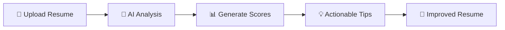

# 🚀 AI Resume Analyzer

<div align="center">


**Transform your career with AI-powered resume analysis**

*Get instant feedback, boost ATS compatibility, and land your dream job faster*

[🎯 Live Demo](https://resumeanalyzer-phi.vercel.app) • [📖 Documentation](#features) • [🛠️ Installation](#installation) • [🤝 Contributing](#contributing)

</div>

---

## ✨ Features

<table>
<tr>
<td width="50%">

### 🤖 **AI-Powered Analysis**
- Advanced machine learning algorithms
- Industry-specific insights
- Real-time feedback generation
- Contextual recommendations

### 📊 **Comprehensive Scoring**
- Overall resume score (0-100)
- ATS compatibility rating
- Content quality assessment
- Skills alignment analysis
- Structure and formatting review

</td>
<td width="50%">

### 🎯 **Smart Features**
- Drag-and-drop file upload
- PDF processing and preview
- Instant results (< 30 seconds)
- Mobile-responsive design
- Secure data handling

### 🔐 **Privacy & Security**
- Secure cloud storage with Supabase
- Row-level security policies
- Encrypted data transmission
- User authentication and authorization

</td>
</tr>
</table>

---

## 🎬 How It Works



1. **📤 Upload** - Drag and drop your PDF resume
2. **🔍 Analyze** - AI processes your resume against job requirements
3. **📈 Score** - Get detailed scores across 5 key areas
4. **💡 Improve** - Receive actionable recommendations
5. **🎯 Succeed** - Land more interviews with an optimized resume

---

## 🚀 Quick Start

### Prerequisites

<table>
<tr>
<td>

**Required:**
- Node.js 18+ 
- npm or yarn
- Modern web browser

</td>
<td>

**Recommended:**
- VS Code with extensions
- Git for version control
- Chrome DevTools

</td>
</tr>
</table>

### Installation

```bash
# 1️⃣ Clone the repository
git clone https://github.com/yourusername/ai-resume-analyzer.git
cd ai-resume-analyzer

# 2️⃣ Install dependencies
npm install

# 3️⃣ Set up Supabase (see SUPABASE_SETUP.md)
cp .env.example .env
# Add your Supabase credentials to .env

# 4️⃣ Start development server
npm run dev

# 5️⃣ Open in browser
# Navigate to http://localhost:5173
```

### 🎉 You're Ready!

The application will be running at `http://localhost:5173` with hot-reload enabled.

> **📋 Important**: Make sure to complete the Supabase setup by following the detailed guide in [SUPABASE_SETUP.md](SUPABASE_SETUP.md) to enable authentication and cloud storage features.

---

## 🛠️ Development

### Available Scripts

| Command | Description | Usage |
|---------|-------------|-------|
| `npm run dev` | Start development server | Development |
| `npm run build` | Build for production | Deployment |
| `npm run preview` | Preview production build | Testing |
| `npm run test` | Run unit tests | Testing |
| `npm run test:ui` | Run tests with UI | Development |

### 📁 Project Structure

```
ai-resume-analyzer/
├── 📁 src/
│   ├── 📁 components/          # React components
│   │   ├── 📁 auth/           # Authentication components
│   │   ├── 📁 layout/         # Layout components
│   │   └── 📁 navigation/     # Navigation components
│   ├── 📁 hooks/              # Custom React hooks
│   ├── 📁 pages/              # Page components
│   ├── 📁 services/           # API services
│   ├── 📁 stores/             # Zustand state management
│   ├── 📁 types/              # TypeScript definitions
│   ├── 📁 utils/              # Utility functions
│   └── 📁 test/               # Test utilities
├── 📁 .kiro/                  # Project specifications
└── 📄 Configuration files
```

---

## 🏗️ Technology Stack

<div align="center">

### Frontend


### Backend & Services


### Development Tools


</div>

### 🔧 Key Technologies

- **React 18** - Modern React with hooks and concurrent features
- **TypeScript** - Type-safe development with enhanced IDE support
- **Tailwind CSS** - Utility-first CSS framework for rapid styling
- **React Router v7** - Declarative routing for React applications
- **Zustand** - Lightweight state management solution
- **Supabase** - Backend-as-a-Service with authentication and storage
- **Vite** - Fast build tool with HMR support
- **Vitest** - Unit testing framework built on Vite

---

## 🎯 Core Features Deep Dive

### 🤖 AI Analysis Engine

The AI analysis engine evaluates resumes across multiple dimensions:

- **ATS Compatibility** - Ensures your resume passes automated screening
- **Content Quality** - Analyzes writing quality and relevance
- **Skills Alignment** - Matches your skills with job requirements
- **Structure & Format** - Reviews layout and organization
- **Tone & Style** - Evaluates professional communication

### 📊 Scoring System

Each resume receives detailed scoring:

```
Overall Score: 85/100
├── ATS Compatibility: 90/100
├── Content Quality: 82/100
├── Skills Alignment: 88/100
├── Structure: 85/100
└── Tone & Style: 80/100
```

### 💡 Actionable Recommendations

Get specific, implementable suggestions:
- ✅ **Strengths** - What's working well
- 🔧 **Improvements** - Specific areas to enhance
- 🎯 **Quick Wins** - Easy changes with high impact

---

## 🔒 Privacy & Security

We take your privacy seriously:

- **Secure Cloud Storage** - Files and data stored securely in Supabase
- **Row-Level Security** - Users can only access their own data
- **Encrypted Transit** - All data is encrypted in transmission
- **Authentication Required** - Secure user authentication and authorization
- **Privacy Controls** - Full control over your data and account

---

## 🤝 Contributing

We welcome contributions! Here's how you can help:

### 🐛 Bug Reports
- Use the issue tracker
- Include reproduction steps
- Provide environment details

### 💡 Feature Requests
- Describe the use case
- Explain the expected behavior
- Consider implementation complexity

### 🔧 Development
```bash
# Fork the repository
# Create a feature branch
git checkout -b feature/amazing-feature

# Make your changes
# Add tests if applicable
npm run test

# Commit your changes
git commit -m 'Add amazing feature'

# Push to your fork
git push origin feature/amazing-feature

# Open a Pull Request
```

---

## 📈 Roadmap

### 🎯 Upcoming Features

- [ ] **Multi-language Support** - Support for non-English resumes
- [ ] **Industry Templates** - Specialized analysis for different industries
- [ ] **Batch Processing** - Analyze multiple resumes at once
- [ ] **Integration APIs** - Connect with job boards and HR systems
- [ ] **Advanced Analytics** - Detailed performance metrics
- [ ] **Resume Builder** - Create resumes from scratch

### 🔮 Future Vision

- AI-powered interview preparation
- Real-time job market insights
- Personalized career recommendations
- Integration with professional networks

---

## 📞 Support

Need help? We're here for you:

- 📧 **Email**: itisaddy7@gmail.com
- 💬 **Discord**: [Join our community](#)
- 📖 **Documentation**: [Full docs](#)
- 🐛 **Issues**: [GitHub Issues](#)

---

## 📄 License

This project is licensed under the MIT License - see the [LICENSE](LICENSE) file for details.

---

<div align="center">

**Made with ❤️ by the AI Resume Analyzer Team**

⭐ **Star this repo if it helped you!** ⭐

[🔝 Back to Top](#-ai-resume-analyzer)

</div>